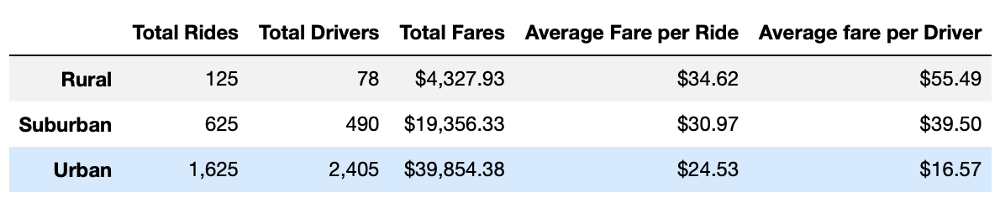
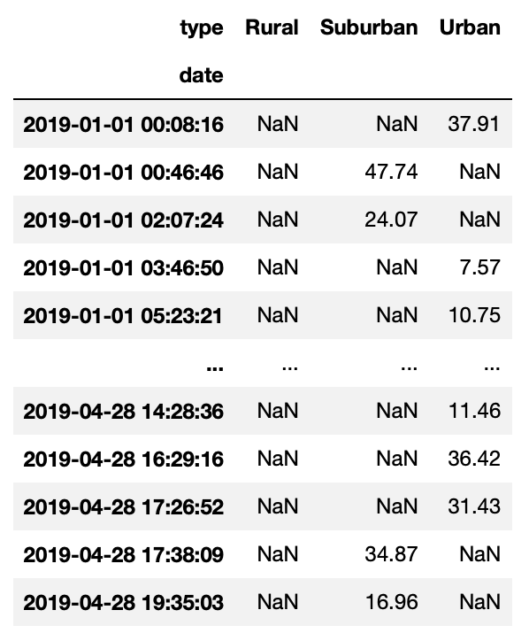
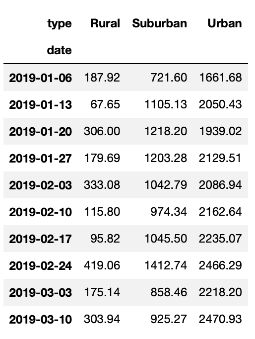
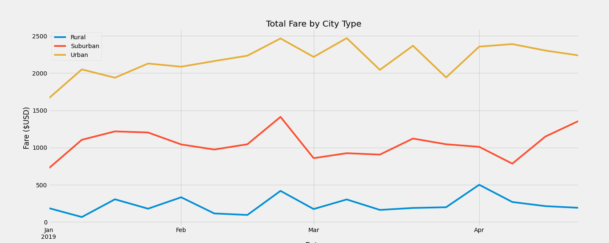

# PyBer_Analysis

## Table of Contents
- [1.0 Project Overview](#Project-Overview)
  * 1.1 Purpose
  * 1.2 Resources
 
- [2.0 Results](#Results)

- [3.0 Summary](#Summary)

- [4.0 Challenges](#Challenges)

## Project Overview
### 1.1 Purpose
Create a summary of the ride sharing data for January to April 2019 by the city type (urban, rurual, and city).

1. Create a line chart plotting the fares for each city type

### 1.2 Resouces
- Data Source: schools_complete.csv and students_complete.csv
- Software: Python 3.6.1, Jupyter Notebook
- Libraries: Pandas, Matplotlib

## Results
* The overall summary of the fares, total drivers, and total riders using the groupby function. The total rides and drivers is higher in Urban city types. 
  
  
  
* Create a pivot table displaying total fare by city type for each date from January to April 2019. 
 
  `df.pivot_table('fare', index = 'date' , columns = 'type')`
 
  `df.loc[date range]`
 
  
 
* Summarize the data on a weekly basis by using resample().

 
 
* Plot the fares vs weekly date on a line chart. 

## Summary

The three recommendations for the CEO are: 

1. 

## Challenges

The instructions for setting up the files was very confusing and it was difficult to submit the proper items. I completed the challenge, but I do not believe the proper format is turned with the combination of the code. It could be helpful to incorporate these steps throughout rather than only providing instructions for how the assignment should be submitted at the very top. 
